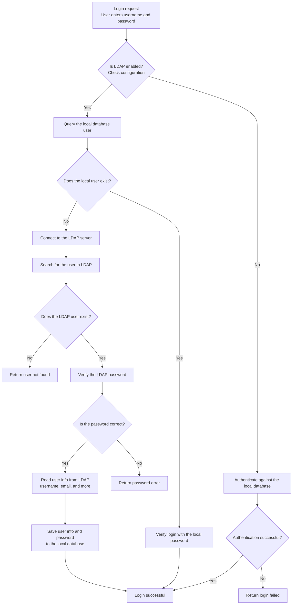

# Advanced Operations

## LDAP Integration

[Configuration](./quick-start.mdx#configuration)

LDAP flow:



## Manage Configurations with Shell Commands

:::warning
The token used here is different from the token used by the web UI, and it expires quickly.
:::

### Nacos-Compatible API

```bash
# Log in and get a token
nacos_accessToken=$(curl -X POST -s "http://localhost:8888/nacos/v1/auth/login" -d "username=admin&password=admin123456" | awk -F '"' '{print $4}')
# Get configuration
curl "http://localhost:8888/nacos/v1/cs/configs?accessToken=${nacos_accessToken}&tenant=test&dataId=test&group=test"
# Update or create configuration
curl -X POST "http://localhost:8888/nacos/v1/cs/configs?accessToken=${nacos_accessToken}" -d "type=properties&tenant=test&dataId=test&group=test" --data-urlencode "content@application-dev.properties"
```

### Standard `confkeeper` API

```bash
# Log in and get a token
nacos_accessToken=$(curl -X POST -s "http://localhost:8888/nacos/v1/auth/login" -d "username=admin&password=admin123456" | awk -F '"' '{print $4}')
# Get configuration
curl -H "Authorization: ${nacos_accessToken}" "http://localhost:8888/api/config/get_by_file?tenant=test&dataId=test&group=test"
# Update or create configuration
curl -X POST -H "Authorization: ${nacos_accessToken}" "http://localhost:8888/api/config/update_by_file" -d "type=properties&tenant=test&dataId=test&group=test" --data-urlencode "content@application-dev.properties"
```

### Use Account Credentials for Simpler Calls

```bash
# Get configuration
curl -X GET "http://localhost:8888/api/config/get_by_user?tenant=test&dataId=test&group=test&username=admin&password=admin123456"

# Update or create configuration
curl -X POST "http://localhost:8888/api/config/update_by_user" -d 'type=properties&tenant=test&dataId=test&group=test&username=admin&password=admin123456' --data-urlencode content@application-dev.properties
```

## Add More Editor Languages

The frontend editor in this project uses [monaco-editor](https://github.com/microsoft/monaco-editor), which is also the editor used by `vscode`.

To keep the bundle size small, these languages are enabled by default: `['json', 'html', 'xml', 'yaml', 'html', 'ini']`.

To add more languages, update both the frontend and backend configurations.

:::tip
Supported languages:

'abap' | 'apex' | 'azcli' | 'bat' | 'bicep' | 'cameligo' | 'clojure' | 'coffee' | 'cpp' | 'csharp' | 'csp' | 'css' | 'cypher' | 'dart' | 'dockerfile' | 'ecl' | 'elixir' | 'flow9' | 'freemarker2' | 'fsharp' | 'go' | 'graphql' | 'handlebars' | 'hcl' | 'html' | 'ini' | 'java' | 'javascript' | 'json' | 'julia' | 'kotlin' | 'less' | 'lexon' | 'liquid' | 'lua' | 'm3' | 'markdown' | 'mdx' | 'mips' | 'msdax' | 'mysql' | 'objective-c' | 'pascal' | 'pascaligo' | 'perl' | 'pgsql' | 'php' | 'pla' | 'postiats' | 'powerquery' | 'powershell' | 'protobuf' | 'pug' | 'python' | 'qsharp' | 'r' | 'razor' | 'redis' | 'redshift' | 'restructuredtext' | 'ruby' | 'rust' | 'sb' | 'scala' | 'scheme' | 'scss' | 'shell' | 'solidity' | 'sophia' | 'sparql' | 'sql' | 'st' | 'swift' | 'systemverilog' | 'tcl' | 'twig' | 'typescript' | 'typespec' | 'vb' | 'wgsl' | 'xml' | 'yaml'
:::

### Backend

```yaml
confkeeper:
  config_type:
    - "xxx"
```

### Frontend

:::tip
The first file must be changed. The second file contains the default value, so it is best to update it as well.
:::

```ts title="rsbuild.config.ts"
plugins: [new MonacoEditorWebpackPlugin({
    languages: ['json', 'html', 'xml', 'yaml', 'html', 'ini'],
    globalAPI: true,
})],
```

```tsx title="src/config/index.tsx"
export const CONFIG_TYPE_LIST: string[] = ['text', 'json', 'xml', 'yaml', 'html', 'properties', 'toml', 'ini'];
```
