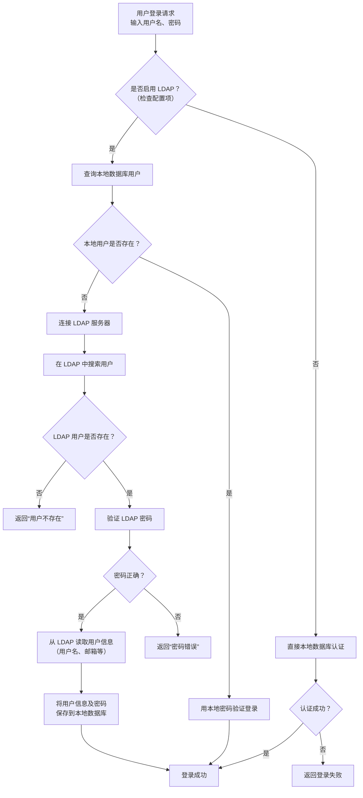

# 更多高级操作

## 接入LDAP

[配置](./快速开始.mdx#配置)

LDAP流程:



## 各种api样式使用shell操作配置

:::warning
这里使用的token和网页使用的不一样，并且失效很短
:::

### nacos兼容接口

```bash
# 登陆获取token
nacos_accessToken=$(curl -X POST -s "http://localhost:8888/nacos/v1/auth/login" -d "username=admin&password=admin123456" | awk -F '"' '{print $4}')
# 获取配置
curl "http://localhost:8888/nacos/v1/cs/configs?accessToken=${nacos_accessToken}&tenant=test&dataId=test&group=test"
# 更新或新建配置
curl -X POST "http://localhost:8888/nacos/v1/cs/configs?accessToken=${nacos_accessToken}" -d "type=properties&tenant=test&dataId=test&group=test" --data-urlencode "content@application-dev.properties"
```

### `confkeeper`标准接口

```bash
# 登陆获取token
nacos_accessToken=$(curl -X POST -s "http://localhost:8888/nacos/v1/auth/login" -d "username=admin&password=admin123456" | awk -F '"' '{print $4}')
# 获取配置
curl -H "Authorization: ${nacos_accessToken}" "http://localhost:8888/api/config/get_by_file?tenant=test&dataId=test&group=test"
# 更新或新建配置
curl -X POST -H "Authorization: ${nacos_accessToken}" "http://localhost:8888/api/config/update_by_file" -d "type=properties&tenant=test&dataId=test&group=test" --data-urlencode "content@application-dev.properties"
```

### 使用账号(简化调用)

```bash
# 获取配置
curl -X GET "http://localhost:8888/api/config/get_by_user?tenant=test&dataId=test&group=test&username=admin&password=admin123456"

# 更新或新建配置
curl -X POST "http://localhost:8888/api/config/update_by_user" -d 'type=properties&tenant=test&dataId=test&group=test&username=admin&password=admin123456' --data-urlencode content@application-dev.properties
```

## 编辑器支持更多语言

此项目前端的编辑器是使用[monaco-editor](https://github.com/microsoft/monaco-editor)的，也就是`vscode`使用的编辑器

目前为了打包体积，我默认支持了这些语言`['json', 'html', 'xml', 'yaml', 'html', 'ini']`

如果需要增加更多语言需要修改前后端配置

:::tip
以下是支持的语言

'abap' | 'apex' | 'azcli' | 'bat' | 'bicep' | 'cameligo' | 'clojure' | 'coffee' | 'cpp' | 'csharp' | 'csp' | 'css' | 'cypher' | 'dart' | 'dockerfile' | 'ecl' | 'elixir' | 'flow9' | 'freemarker2' | 'fsharp' | 'go' | 'graphql' | 'handlebars' | 'hcl' | 'html' | 'ini' | 'java' | 'javascript' | 'json' | 'julia' | 'kotlin' | 'less' | 'lexon' | 'liquid' | 'lua' | 'm3' | 'markdown' | 'mdx' | 'mips' | 'msdax' | 'mysql' | 'objective-c' | 'pascal' | 'pascaligo' | 'perl' | 'pgsql' | 'php' | 'pla' | 'postiats' | 'powerquery' | 'powershell' | 'protobuf' | 'pug' | 'python' | 'qsharp' | 'r' | 'razor' | 'redis' | 'redshift' | 'restructuredtext' | 'ruby' | 'rust' | 'sb' | 'scala' | 'scheme' | 'scss' | 'shell' | 'solidity' | 'sophia' | 'sparql' | 'sql' | 'st' | 'swift' | 'systemverilog' | 'tcl' | 'twig' | 'typescript' | 'typespec' | 'vb' | 'wgsl' | 'xml' | 'yaml'
:::

### 后端

```yaml
confkeeper:
  config_type:
    - "xxx"
```

### 前端

:::tip
第一个文件是必须改，第二个文件为默认值，也是最好改
:::

```ts title="rsbuild.config.ts"
plugins: [new MonacoEditorWebpackPlugin({
    languages: ['json', 'html', 'xml', 'yaml', 'html', 'ini'],
    globalAPI: true,
})],
```

```tsx title="src/config/index.tsx"
export const CONFIG_TYPE_LIST: string[] = ['text', 'json', 'xml', 'yaml', 'html', 'properties', 'toml', 'ini'];
```
